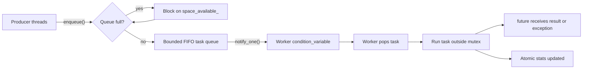
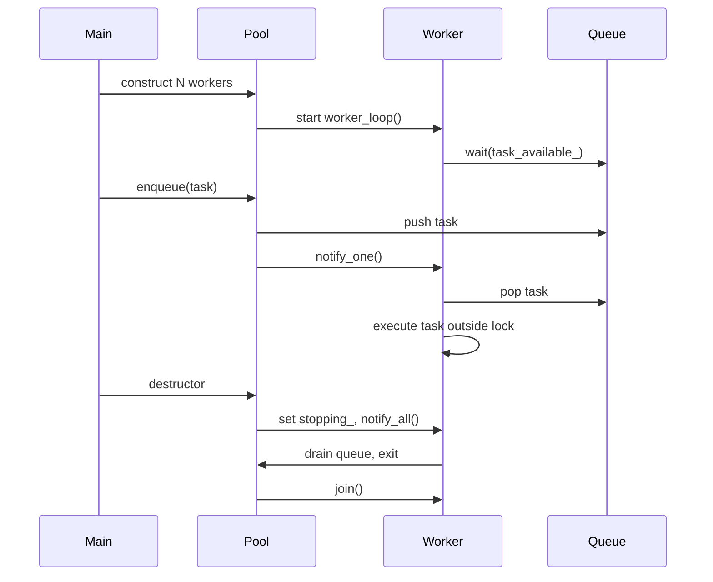
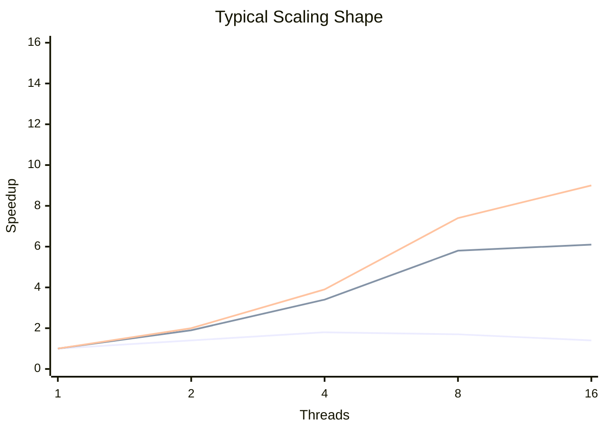

# Modern C++ Thread Pool

Production-oriented fixed-size thread pool in C++17 with a bounded task queue, backpressure, instrumentation, graceful shutdown, and a benchmark matrix that exposes scaling behavior across workload sizes and thread counts.

## Highlights

| Feature | Implementation |
| --- | --- |
| Worker model | Fixed-size `std::thread` pool |
| Queue | `std::queue<std::function<void()>>` protected by `std::mutex` |
| Synchronization | `std::condition_variable` for sleeping workers and blocked producers |
| Backpressure | Bounded queue with blocking `enqueue()` |
| Results | `std::future<T>` via `std::packaged_task<T()>` |
| Shutdown | RAII destructor drains queued work and joins workers |
| Instrumentation | Submitted, completed, wrapper failures, peak queue size |
| Benchmarking | Serial vs pool, 1 to `hardware_concurrency()` threads, small/medium/large task sizes |

## Architecture



## Worker Lifecycle



## Why A Bounded Queue?

The pool uses blocking backpressure: when the queue reaches its maximum size, `enqueue()` waits until a worker removes a task.

This is the right default for many systems workloads because it prevents unbounded memory growth and makes overload visible to producers. Rejecting tasks can be useful for latency-sensitive services, but it pushes retry, loss, and error handling policy onto callers.

## Contention Model

The main contention point is the queue mutex. Producers briefly hold it to push work; workers briefly hold it to pop work. Task execution happens outside the lock, so user code does not block queue progress.

For small tasks, the overhead of locking, notification, wakeup, and context switching can dominate the useful work. Medium and large tasks usually scale better because synchronization overhead is amortized over more computation.

## Mutex Queue vs Lock-Free Queue

| Approach | Strengths | Costs |
| --- | --- | --- |
| Mutex queue | Simple, portable, easy shutdown semantics, predictable correctness | Shared contention point under high producer/consumer pressure |
| Lock-free queue | Can reduce blocking and improve throughput in some workloads | Hard memory reclamation, subtle ordering bugs, fairness concerns, more complex shutdown |

For a general-purpose pool, a mutex queue is often the right first production design. Systems that need higher throughput can evolve toward per-worker queues, batching, or work stealing.

## Build

Linux/macOS:

```bash
g++ -std=c++17 -O2 -pthread thread_pool.cpp -o thread_pool
./thread_pool
```

Windows with MSVC Developer Command Prompt:

```bat
cl /std:c++17 /O2 /EHsc thread_pool.cpp
thread_pool.exe
```

## Example Output

```text
hardware_concurrency: 8

workload   threads     tasks    iters/task     serial_ms       pool_ms   speedup       tasks/sec   submitted   completed    failures      peak_q
--------------------------------------------------------------------------------------------------------------------------------------------------
small            1      2000         50000        120.42        127.85      0.94        15643.33        2000        2000           0          16
small            2      2000         50000        120.42         68.11      1.77        29364.26        2000        2000           0          16
medium           4       512        500000        310.20         84.77      3.66         6039.87         512         512           0          16
large            8       128       5000000       7600.10       1014.33      7.49          126.19         128         128           0          32
```

Exact numbers depend on CPU topology, thermal limits, compiler, optimization level, operating system scheduler, and background load.

## Benchmark Interpretation



Small tasks often flatten early because dispatch overhead is a large fraction of runtime. Large tasks usually scale closer to core count until the machine saturates, then additional threads can add context-switch overhead and cache pressure.

## Future Improvements

- Per-worker queues to reduce global queue contention.
- Work stealing for load balancing when tasks have variable durations.
- Task priorities for latency-sensitive work.
- Batching dequeue operations to amortize lock acquisition.
- Cancellation tokens and deadlines.
- NUMA-aware scheduling for large multi-socket systems.

